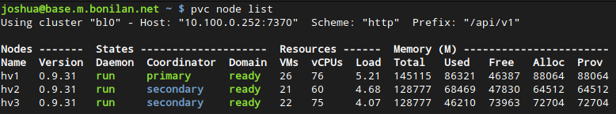
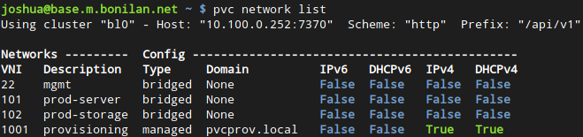
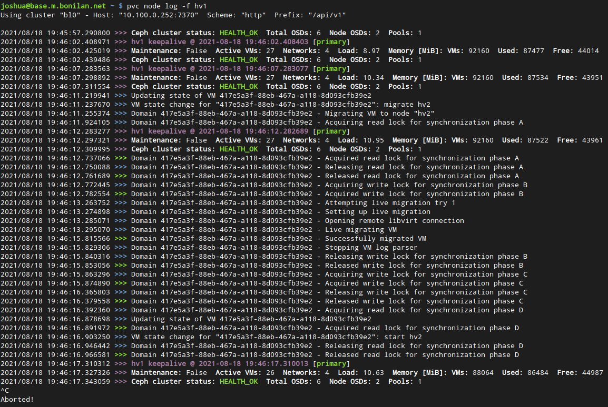

  

## What is PVC?

PVC is a Linux KVM-based hyperconverged infrastructure (HCI) virtualization cluster solution that is fully Free Software, scalable, redundant, self-healing, self-managing, and designed for administrator simplicity. It is an alternative to other HCI solutions such as Harvester, Nutanix, and VMWare, as well as to other common virtualization stacks such as ProxMox and OpenStack.

PVC is a complete HCI solution, built from well-known and well-trusted Free Software tools, to assist an administrator in creating and managing a cluster of servers to run virtual machines, as well as self-managing several important aspects including storage failover, node failure and recovery, virtual machine failure and recovery, and network plumbing. It is designed to act consistently, reliably, and unobtrusively, letting the administrator concentrate on more important things.

PVC is highly scalable. From a minimum (production) node count of 3, up to 12 or more, and supporting many dozens of VMs, PVC scales along with your workload and requirements. Deploy a cluster once and grow it as your needs expand.

As a consequence of its features, PVC makes administrating very high-uptime VMs extremely easy, featuring VM live migration, built-in always-enabled shared storage with transparent multi-node replication, and consistent network plumbing throughout the cluster. Nodes can also be seamlessly removed from or added to service, with zero VM downtime, to facilitate maintenance, upgrades, or other work.

PVC also features an optional, fully customizable VM provisioning framework, designed to automate and simplify VM deployments using custom provisioning profiles, scripts, and CloudInit userdata API support.

Installation of PVC is accomplished by two main components: a [Node installer ISO](https://github.com/parallelvirtualcluster/pvc-installer) which creates on-demand installer ISOs, and an [Ansible role framework](https://github.com/parallelvirtualcluster/pvc-ansible) to configure, bootstrap, and administrate the nodes. Installation can also be fully automated with a companion [cluster bootstrapping system](https://github.com/parallelvirtualcluster/pvc-bootstrap). Once up, the cluster is managed via an HTTP REST API, accessible via a Python Click CLI client or WebUI.

Just give it physical servers, and it will run your VMs without you having to think about it, all in just an hour or two of setup time.

## What is it based on?

The core node and API daemons, as well as the CLI API client, are written in Python 3 and are fully Free Software (GNU GPL v3). In addition to these, PVC makes use of the following software tools to provide a holistic hyperconverged infrastructure solution:

  * Debian GNU/Linux as the base OS.
  * Linux KVM, QEMU, and Libvirt for VM management.
  * Linux `ip`, FRRouting, NFTables, DNSMasq, and PowerDNS for network management.
  * Ceph for storage management.
  * Apache Zookeeper for the primary cluster state database.
  * Patroni PostgreSQL manager for the secondary relation databases (DNS aggregation, Provisioner configuration).

## Getting Started

To get started with PVC, please see the [About](https://parallelvirtualcluster.readthedocs.io/en/latest/about/) page for general information about the project, and the [Getting Started](https://parallelvirtualcluster.readthedocs.io/en/latest/getting-started/) page for details on configuring your first cluster.

## Changelog

View the changelog in [CHANGELOG.md](https://github.com/parallelvirtualcluster/pvc/blob/master/CHANGELOG.md).

## Screenshots

While PVC's API and internals aren't very screenshot-worthy, here is some example output of the CLI tool.

 <i>Listing the nodes in a cluster</i>

 <i>Listing the networks in a cluster, showing 3 bridged and 1 IPv4-only managed networks</i>

 <i>Listing a limited set of VMs and migrating one with status updates</i>

 <i>Viewing the logs of a node (keepalives and VM [un]migration)</i>

